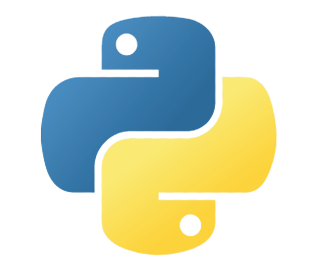

# 
Hi there, I'm Divyam 👋

## 
I am a Computer Science UnderGrad

</img>

- 🌱 I’m currently learning ReactJS
- 👯 I’m looking to collaborate on Full Stack Web Development
- 🤔 I’m looking for help with Data Structures
- 📫 How to reach me: divyamjain29@gmail.com
- 😄 Pronouns: He/Him
- ⚡ Fun fact: You are always living in the past.

<h3>Skills:</h3>

&nbsp&nbsp 

